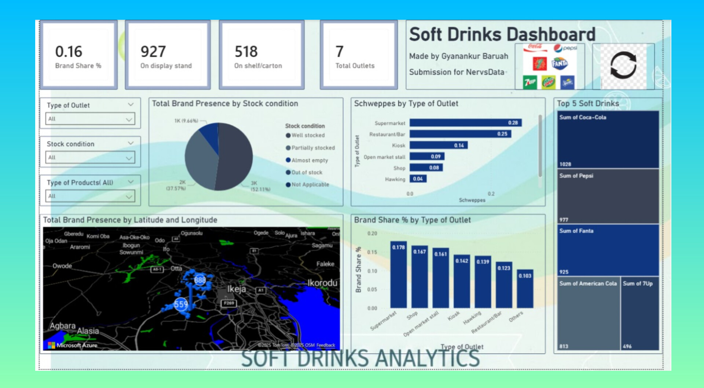

# 🥤 Soft Drinks Dashboard – NervsData Challenge Submission

This repository contains the Power BI dashboard created by **Gyanankur Baruah** for the **NervsData Product Visibility Challenge**. The dashboard visualizes soft drink brand performance across various outlet types and geographic locations, highlighting product display patterns, packaging preferences, and stock conditions.

---

## 📊 Dashboard Overview

The dashboard provides a comprehensive analysis of soft drink visibility using field data collected from multiple outlets. Key metrics and visuals include:

- **Brand Share %**: Relative presence of each brand across all outlets.
- **Product Display Insights**: Breakdown of how products are displayed — on shelves, in coolers, on stands, or actively consumed.
- **Outlet Type Distribution**: Comparison of brand performance across outlet types like supermarkets, kiosks, shops, and hawking.
- **Stock Condition Analysis**: Categorization of outlets by stock status — well stocked, partially stocked, almost empty, or out of stock.
- **Packaging Mix**: Distribution of PET bottles, glass bottles, and cans.
- **Geographic Spread**: Map visualization showing outlet density and brand presence across regions like Ikeja and Ikorodu.

---

## 📌 Key Metrics

| Metric                     | Value     |
|---------------------------|-----------|
| Brand Share %             | 0.16      |
| On Display Stand          | 927       |
| On Shelf/Carton           | 518       |
| Total Outlets             | 7         |
| Top 5 Brands (by volume)  | Coca-Cola (1028), Pepsi (977), Fanta (925), American Cola (813), 7Up (496) |

---

## 📍 Visual Highlights

- **Pie Chart**: *Total Brand Presence by Stock Condition*  
  - Categories: Well stocked, Partially stocked, Almost empty, Out of stock, Not Applicable  
  - Distribution: 1K (9.64%), 2K (37.57%), 3K (52.11%)

- **Bar Chart**: *Schweppes by Type of Outlet*  
  - Top outlets: Supermarket (0.28), Restaurant/Bar (0.25), Kiosk (0.14)

- **Map**: *Total Brand Presence by Latitude and Longitude*  
  - Highlights: Ikeja (888), Ikorodu (559)

- **Bar Chart**: *Brand Share % by Type of Outlet*  
  - Leading outlets: Supermarket (0.178), Shop (0.167), Open market stall (0.161)

---

## 🧠 Insights & Impact

This dashboard enables stakeholders to:

- Identify top-performing brands and their outlet preferences.
- Detect stock availability issues across regions.
- Understand packaging trends and consumer display behavior.
- Make data-driven decisions for product placement and distribution strategy.

---

## 🛠 Tools Used

- **Power BI Desktop** (.pbix)
- **Field Data** from NervsData Challenge
- **Geospatial Mapping** using Latitude and Longitude

---

## 📁 Repository Structure

`
📦 Soft-Drinks-Dashboard/
├── dashboard.png                          # Main dashboard image for README
├── README.md                              # Project documentation
├── Product Visibility Challenge Data.csv  # Cleaned dataset used for analysis
├── Soft Drinks Dashboard.pdf              # Exported static version of the dashboard
├── dashboard.jpg                          # Alternate dashboard image (lower resolution)
└── soft drinks nervus challenge.pbix      # Power BI source file
`

---

## 🙌 Author

Gyanankur Baruah  
Data storyteller | Dashboard designer | Hackathon finalist  
Connect on LinkedIn

---

## 📜 License

This project is submitted as part of the NervsData challenge. For reuse or adaptation, please credit the author and the challenge organizers.
`
